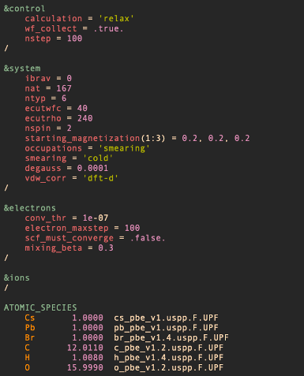

# Quantum ESPRESSO syntax for Vim

## Installing
```
./install.sh
```

## Syntax Highlighting


## Autocompletion
While typing use `<C-p>` and `<C-n>` to cycle through autocomplete options.  
test1:  
  
test2:  
<video controls loop>
    <source src="media/autocomplete.mov" type="video/mp4">
</video>

### Fix incompatability with YouCompleteMe
Add this line to your `~/.vimrc` to disable YouCompleteMe for the espresso filetype:
```
let g:ycm_filetype_blacklist = { 'espresso': 1 }
```
